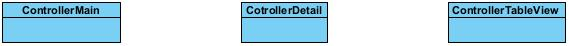
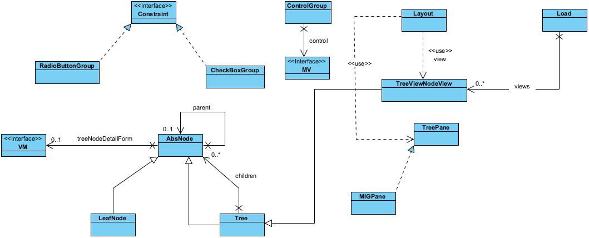
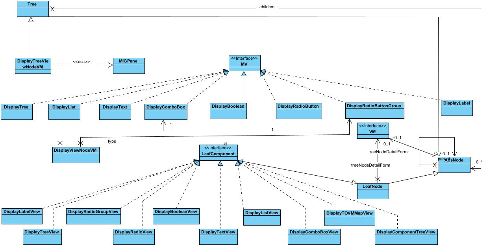
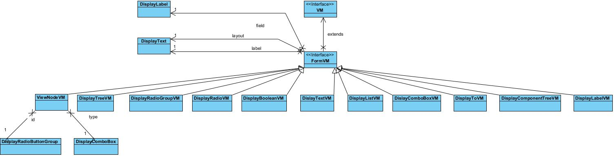
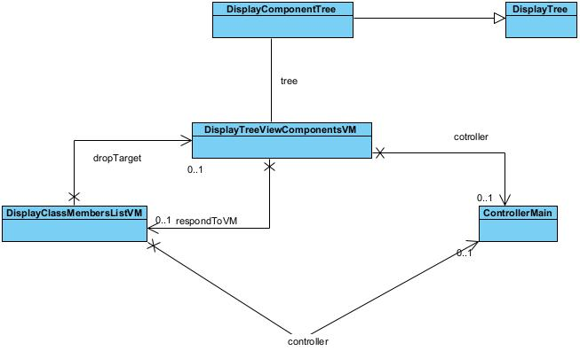

# Scala FX Form 

## Introduction
This is a library that uses JavaFX to implement a user interface form builder in Scala 3. This file is an overview of the model.

## License

## Models
Note that the class definitions and descriptions do not necessarily correspond to the diagram. This is because the class definition are taken out of the packages and the diagrams are loosely based on the packages.

### Controller
  
These are the JavaFX controllers used.  

1. ControllerMain  
The main controller that contain the ListVM, TreeVM and the tree detail forms panel. This is the controller for form_main.fxml.  

2. ControllerDetail  
This is the controller for form_detail.fxml. It is used to display view model detail in in a window if the detail panes are not defined.  

3. ControllerTableView  
This is the controller for form_tableview.fxml. It is used to display the TreeVM in the Tree in ControllerMain. 

### Layout
  
1. RadioButtonGroup  
A group of related radio buttons. This class ensures that the buttons all belong to the same ToggleGroup of buttons.

2. CheckBoxGroup  
Not used at the moment. It is supposed to be: A group of related checkboxes. When asked for the current value it should return a set it selected items.

3. Layout  
Object that does the layout of the Nodes defined in the view models. 

4. Load  
Object that loads the layout of the view models from json files.

5. MIGPane  
The one and only pane that is used to add Nodes to.

6. ControlGroup  
A Group of controls. This references the relevant constraint and the list of nodes that is looks after.

7. AbsNode  
Root of a tree.This is the tree definition of the layout of view models

8. LeafNode  
Leaf node of a tree.

9. Tree
A Tree node. This node has children. A child can either be a Leaf node or Tree node.

### Nodes
  
1. DisplayTree()  
Display a basic TreeView.

2. DisplayList()  
Display a basic TableView.

3. DisplayText()  
Display Text component.

4. DisplayComboBox()  
Display ComboBox.

5. DisplayBoolean()  
Display CheckBox.

6. DisplayRadioButton()  
Display RadioButton.

7. DisplayRadioGroup()  
Display RadioButtonGroup.

8. DisplayLabel()  
Display Label

9. DisplayLabelView()  
Load and save the treeNodeDetailForm detail of the DisplayLabelVM in or from json file. Display the leaf node information on the tree via toString

10. DisplayTreeView()  
Load and save the treeNodeDetailForm detail of the DisplayTreeVM in or from json file. Display the leaf node information on the tree via toString

11. DisplayRadioGroupView()  
Load and save the treeNodeDetailForm detail of the DisplayRadioGroupVM in or from json file. Display the leaf node information on the tree via toString

12. DisplayRadioView()  
Load and save the treeNodeDetailForm detail of the DisplayRadioVM in or from json file. Display the leaf node information on the tree via toString

13. DisplayBooleanView()  
Load and save the treeNodeDetailForm detail of the DisplayBooleanVM in or from json file. Display the leaf node information on the tree via toString

14. DisplayTextView()  
Load and save the treeNodeDetailForm detail of the DisplayTextVM in or from json file. Display the leaf node information on the tree via toString

15. DisplayListView()  
Load and save the treeNodeDetailForm detail of the DisplayListVM in or from json file. Display the leaf node information on the tree via toString

16. DisplayComboBoxView()  
Load and save the treeNodeDetailForm detail of the DisplayComboBoxVM in or from json file. Display the leaf node information on the tree via toString

17. DisplayTOVMMapView()  
Load and save the treeNodeDetailForm detail of the DisplayTOVMMapVM in or from json file. Display the leaf node information on the tree via toString

18. DisplayComponentTreeView()  
Load and save the treeNodeDetailForm detail of the DisplayComponentTreeVM in or from json file. Display the leaf node information on the tree via toString

19. TreeViewNodeView()  
Load and save the treeNodeDetailForm detail of the TreeViewNodeVM in or from json file. Display the leaf node information on the tree via toString.

### ViewModel
  
All the view models in the library.

1. DisplayTreeViewNodeVM  

2. DisplayTreeVM  

3. DisplayRadioGroupVM  

4. DisplayRadioVM  

5. DisplayBooleanVM  

6. DisplayTextVM  

7. DisplayListVM  

8. DisplayComboBoxVM  

9. DisplayToVM  

10. DisplayComponentTreeVM  

11. DisplayLabelVM  

### ListVM
  
1. Member  
Members of the list

2. DisplayMemberList  
The list

3. DisplayClassMembersListVM  
Compound display of combo box and class members. The class member list is that of the class of the item selected in the combo box.

### TreeVM
  
1. DisplayComponentTree  
The tree view that is displaying the layout of the form.

2. DisplayTreeViewComponentsVM
Implements drag and drop (verify this).

## Current Version
The current version is 0.0.0 dev

## Usage

