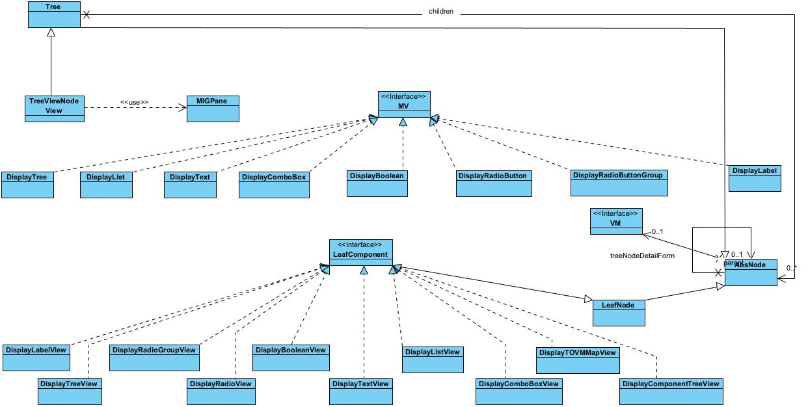
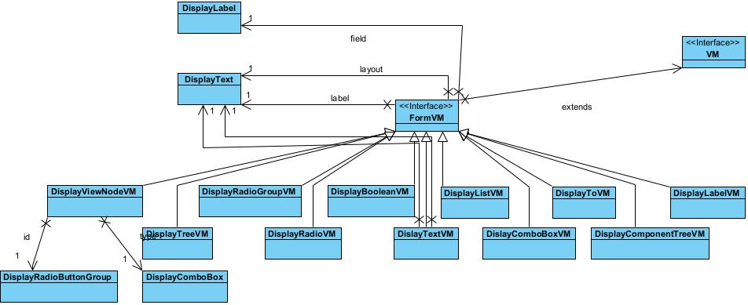
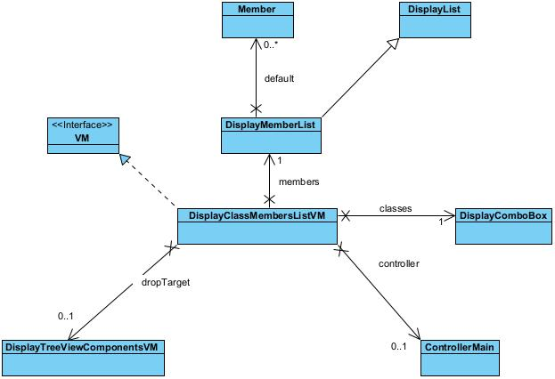

# Scala FX Form 

## Introduction
This is a library that uses JavaFX to implement a user interface form builder in Scala 3. This file is an overview of the model.

## License
Copyright 2021 F G Myburgh

Permission is hereby granted, free of charge, to any person obtaining a copy of this software and associated documentation files (the "Software"), to deal in the Software without restriction, including without limitation the rights to use, copy, modify, merge, publish, distribute, sublicense, and/or sell copies of the Software, and to permit persons to whom the Software is furnished to do so, subject to the following conditions:

The above copyright notice and this permission notice shall be included in all copies or substantial portions of the Software.

THE SOFTWARE IS PROVIDED "AS IS", WITHOUT WARRANTY OF ANY KIND, EXPRESS OR IMPLIED, INCLUDING BUT NOT LIMITED TO THE WARRANTIES OF MERCHANTABILITY, FITNESS FOR A PARTICULAR PURPOSE AND NONINFRINGEMENT. IN NO EVENT SHALL THE AUTHORS OR COPYRIGHT HOLDERS BE LIABLE FOR ANY CLAIM, DAMAGES OR OTHER LIABILITY, WHETHER IN AN ACTION OF CONTRACT, TORT OR OTHERWISE, ARISING FROM, OUT OF OR IN CONNECTION WITH THE SOFTWARE OR THE USE OR OTHER DEALINGS IN THE SOFTWARE.

## Models
Note that the class definitions and descriptions do not necessarily correspond to the diagram. This is because the class definition are taken out of the packages and the diagrams are loosely based on the packages.

These are notes for myself:
1. At the moment a view.json file must exist for a javafx node hierarchy to be rendered. This is because the view file contains the metadata of what gets rendered where on the parent pane. **NB** look into default rendering, easiest will be defining an empty mig pane node and then have the default been empty , this will prevent the code from falling over when the view is not defined.
2. Fixup the while config file issue. The view.json data location should be kept in the config file of the application that uses this library.

### Controller
  
These are the JavaFX controllers used.  *NB* Be careful with the naming of the controllers fxml files in a project using this library. Name clashes can have unintended side effects that is only detected at runtime.

### Layout
  

The layout package does the layout of the javafx nodes onto the mig pane. The way the nodes are ordered onto the mig pane is defined by a view json file. This is done using the Load object. The load object holds the roots of these tree definition in the views reference. The Layout object uses these tree definition to do the layout of the relevant class variables.

Radio buttons must be grouped as selecting one in the group must unselect the others in the group. Check Box Group is currently not used.

The json file content represents a Tree structure. This is modelled by AbsNode, Tree and LeafNode. Each AbsNode has a reference to the tree node detail form. This form holds the data loaded from the json file.

This is an example of the content of a json file.
<pre>
{
    "node": {
        "type": "MIGLAYOUT",
        "label": "Test",
        "layout": " :: :: ",
        "children": [
            {
                "DisplayLabel": {
                    "label": "Field",
                    "field": "field",
                    "layout": "wrap"
                }
            },
            {
                "DisplayText": {
                    "validateREGEX": "",
                    "errString": "",
                    "label": "Label",
                    "field": "label",
                    "layout": "wrap:: :: "
                }
            },
            {
                "DisplayText": {
                    "validateREGEX": "",
                    "errString": "",
                    "label": "MIG Layout",
                    "field": "layout",
                    "layout": " :: :: "
                }
            }
        ]
    }
}
</pre>

### Nodes
  
The MV (model View) classes are the actual view on the model to be displayed to the user on the mig pane. These hold the javafx components to be displayed. The Layout object will get the javafx component and ask it to render itself on the mig pane. 

The LeafComponents child classes contain the logic to load and save the VM (treeNodeDetailForm) content to and from the json file.

### ViewModel
  
The VM (view models) are all forms representations that holds information loaded from the json file. This means that they are not the form itself only the meta data required to create the form. These classes also holds the information as defined by the json file. See above for an example of the json view file. In
<pre>
            {
                "DisplayText": {
                    "validateREGEX": "",
                    "errString": "",
                    "label": "MIG Layout",
                    "field": "layout",
                    "layout": " :: :: "
                }
            }
</pre>
The information loaded is the validateREGEX, errString, label, field and layout.

### ListVM
  

### TreeVM
  

## Current Version
The current version is 0.0.0 dev

## Usage
This library is not ready for general usage.

